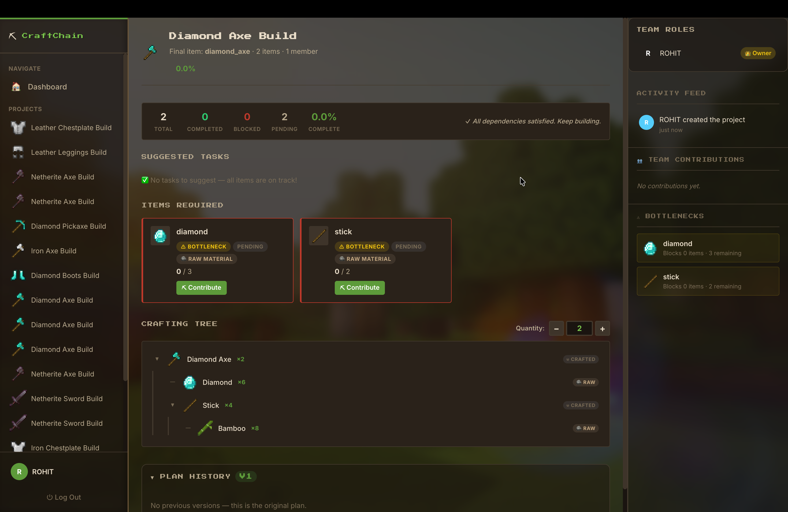
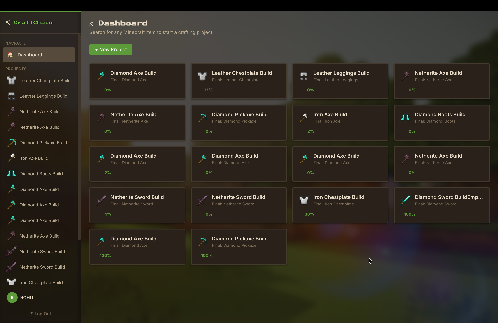
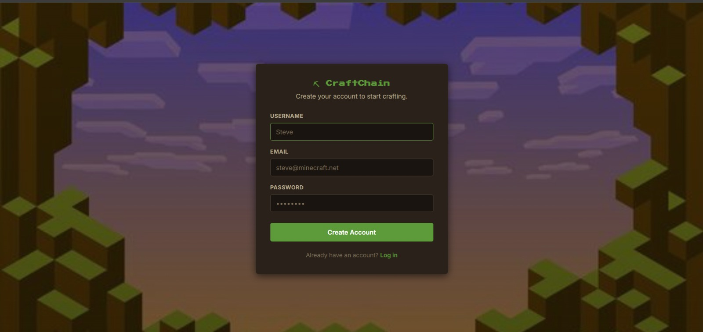

<p align="center">
  
</p>

<h1 align="center">⛏ CraftChain</h1>

<p align="center">
  <strong>Collaborative Minecraft Crafting Project Manager</strong><br/>
  Plan builds, assign roles, track materials, and craft together — in real time.
</p>

<p align="center">
  
  
  
  
  
</p>

---

## 📸 Screenshots

### Dashboard — All Projects at a Glance

<p align="center">
  
</p>

> Browse all crafting projects with live progress percentages, Minecraft item icons, and quick navigation. Create new projects with a single click.

### Project View — Full Build Management

<p align="center">
  
</p>

> Each project shows a **stats strip**, **suggested tasks** based on your role, **item cards** with bottleneck detection, an interactive **crafting tree**, **plan history** with version restore, **team roles**, **activity feed**, **contribution tracking**, and **bottleneck highlights** — all on one page.

---

## ✨ Features

| Feature                      | Description                                                                                                     |
| ---------------------------- | --------------------------------------------------------------------------------------------------------------- |
| 🔍 **Minecraft Auto-Fill**   | Search any Minecraft item → auto-generate the full dependency tree using `minecraft-data`                       |
| 📊 **Crafting Tree**         | Interactive, expandable tree showing ingredient quantities with scaling                                         |
| 👥 **Team Roles**            | Assign members as ⛏ **Miner**, 🧱 **Builder**, or 📋 **Planner**                                                |
| 🎯 **Suggested Tasks**       | Smart, role-based task suggestions (Miners → raw materials, Builders → craftable items, Planners → bottlenecks) |
| 📦 **Contribution Tracking** | Contribute items with optimistic UI updates + atomic rollback safety                                            |
| ⚠ **Bottleneck Detection**   | Automatic identification of blocking items with visual highlights                                               |
| 📜 **Plan Versioning**       | Every plan update is snapshotted. Owner can restore any previous version                                        |
| 📈 **Stats Strip**           | Real-time completion percentage, blocked/pending counts                                                         |
| 🔐 **JWT Auth**              | Secure registration + login with hashed passwords                                                               |
| 🎮 **Demo Mode**             | Graceful fallback with static data when backend is unavailable                                                  |

---

## 🚀 Quick Start

```bash
# 1. Clone
git clone https://github.com/sumitsah03690-bit/craftchain.git
cd craftchain

# 2. Configure environment
cp .env.example .env
# Edit .env → add your MONGODB_URI and JWT_SECRET

# 3. Install all dependencies (root + server + client)
npm install

# 4. Start both dev servers
npm run dev
```

| Service      | URL                                                                  |
| ------------ | -------------------------------------------------------------------- |
| React Client | [http://localhost:5173](http://localhost:5173)                       |
| API Server   | [http://localhost:4000/api/health](http://localhost:4000/api/health) |

---

## 🏗 Architecture

```
CRAFTCHAIN/
├── client/                    # React + Vite frontend
│   ├── src/
│   │   ├── components/        # Reusable UI components
│   │   │   ├── ItemCard.jsx         # Item with bottleneck badges
│   │   │   ├── DependencyTree.jsx   # Interactive crafting tree
│   │   │   ├── RoleManager.jsx      # Team role assignment panel
│   │   │   ├── SuggestedTasks.jsx   # Role-based task suggestions
│   │   │   ├── PlanHistory.jsx      # Version timeline + restore
│   │   │   ├── ContributionModal.jsx
│   │   │   ├── ActivityFeed.jsx
│   │   │   └── MinecraftIcon.jsx    # Auto-loads item sprites
│   │   ├── pages/
│   │   │   ├── Dashboard.jsx        # Project grid + search + create
│   │   │   ├── ProjectPage.jsx      # Full project management view
│   │   │   ├── Login.jsx
│   │   │   └── Signup.jsx
│   │   ├── contexts/
│   │   │   └── AuthContext.jsx      # JWT auth + authFetch wrapper
│   │   └── index.css                # Global styles + design system
│   └── public/assets/items/         # 197 Minecraft item sprites
│
├── server/                    # Express API backend
│   ├── models/
│   │   ├── User.js                  # Username, email, bcrypt hash
│   │   └── Project.js               # Items, members, roles, versions
│   ├── routes/
│   │   ├── auth.js                  # POST /register, /login
│   │   ├── projects.js              # Full CRUD + contribute + roles
│   │   └── recipes.js               # Minecraft recipe lookup
│   ├── utils/
│   │   ├── minecraft.js             # Auto-fill engine (minecraft-data)
│   │   └── projectHelpers.js        # Status engine, bottlenecks
│   └── middleware/
│       └── authMiddleware.js        # JWT verification
│
├── .env.example
└── package.json               # npm workspaces monorepo
```

---

## 🔌 API Endpoints

### Auth

| Method | Route                | Description       |
| ------ | -------------------- | ----------------- |
| POST   | `/api/auth/register` | Create account    |
| POST   | `/api/auth/login`    | Login → JWT token |

### Projects

| Method | Route                                    | Description                       |
| ------ | ---------------------------------------- | --------------------------------- |
| POST   | `/api/projects`                          | Create project (with auto-fill)   |
| GET    | `/api/projects`                          | List projects (paginated)         |
| GET    | `/api/projects/:id`                      | Full detail + roles + suggestions |
| PUT    | `/api/projects/:id`                      | Update project                    |
| POST   | `/api/projects/:id/join`                 | Join with optional role           |
| POST   | `/api/projects/:id/contribute`           | Contribute items (atomic)         |
| PATCH  | `/api/projects/:id/members/:userId/role` | Assign role (owner only)          |
| POST   | `/api/projects/:id/update-plan`          | Update plan with versioning       |
| GET    | `/api/projects/:id/plan-history`         | Version history                   |
| POST   | `/api/projects/:id/restore-plan/:v`      | Restore previous version          |
| DELETE | `/api/projects/:id`                      | Delete project                    |

### Recipes

| Method | Route                          | Description              |
| ------ | ------------------------------ | ------------------------ |
| GET    | `/api/recipes/search?q=`       | Search Minecraft items   |
| GET    | `/api/recipes/lookup?item=`    | Get recipe + ingredients |
| GET    | `/api/recipes/tree?item=&qty=` | Full dependency tree     |

---

## ⚙ Environment Variables

| Variable      | Description                | Default                 |
| ------------- | -------------------------- | ----------------------- |
| `MONGODB_URI` | MongoDB connection string  | _(required)_            |
| `JWT_SECRET`  | Secret for signing JWTs    | `change-me-...`         |
| `PORT`        | Express server port        | `4000`                  |
| `CLIENT_URL`  | React client origin (CORS) | `http://localhost:5173` |

---

## 🧰 Tech Stack

- **Frontend:** React 19 · Vite 7 · React Router · CSS custom properties
- **Backend:** Node.js · Express · Mongoose · JWT + bcrypt
- **Database:** MongoDB Atlas
- **Game Data:** `minecraft-data` npm package (1.19 recipes)
- **Deployment:** Vercel (frontend) · Render/Railway (backend)

---

## 📜 Available Scripts

| Command         | Description                       |
| --------------- | --------------------------------- |
| `npm run dev`   | Start client + server in parallel |
| `npm run build` | Production build (Vite)           |
| `npm run start` | Start Express (production)        |

---

## 👥 Team

Built during a hackathon by the CraftChain team.

## 📄 License

MIT — hack away! 🚀
